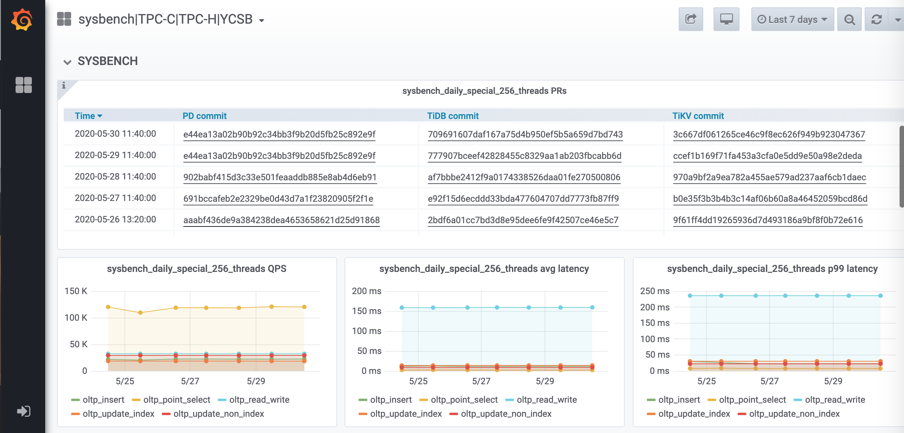

In PingCAP. We build a platform and many tools for benchmarking. The platform contains many standerd bencmarking(such as TPCC/TPCH/YCSB/SYSBENCH).

## Benchmark Platform
The platform is [here](http://perf.pingcap.com)

## Benchmark Tools
- [go-tpc](https://github.com/pingcap/go-tpc). We implement it to simplify to run TPCC and TPCH (for load data about 3-10x faster then benchmarksql and much easy to use). You can just using `./bin/go-tpc -H 127.0.0.1 -P 3306 -D tpcc tpcc --warehouses 4 --parts 4 prepare` to prepare data and `./bin/go-tpc  -H 127.0.0.1 -P 3306 -D tpcc tpcc --warehouses 4 run` to run. Yes, just 2 or 3 steps
- [go-ycsb](https://github.com/pingcap/go-ycsb). It is also very easy to use