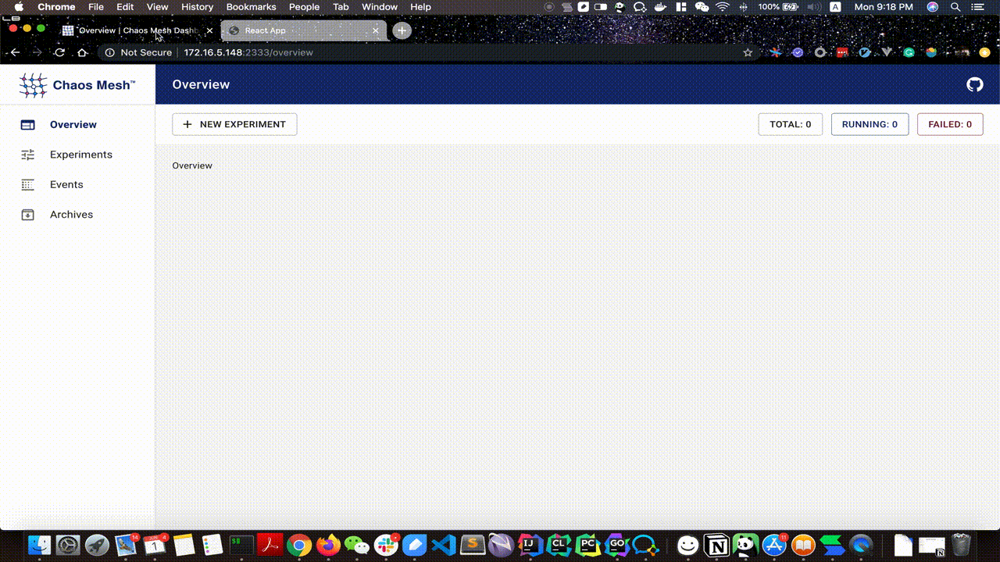
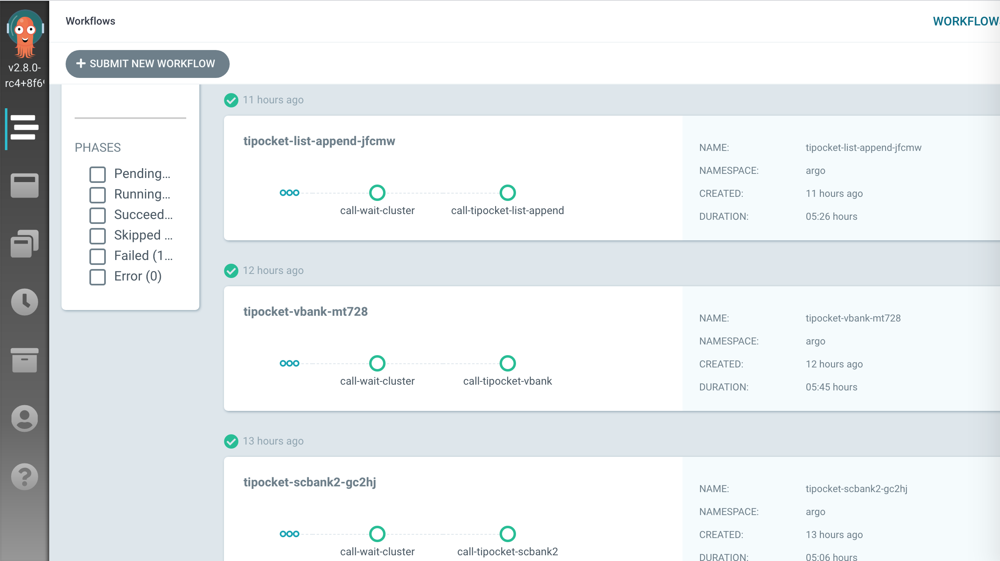

# Chaos testing

As a high availability DBMS. We need to make sure TiDB Cluster is perfrom well in disaster。That is, when there are chaos, TiDB Cluster still should work well.

In the last year. we open source our chaos platform [Chaos Mesh™](https://github.com/pingcap/chaos-mesh).

Chaos Mesh™ is a chaos engineering platform for kubernetes, now it can trigger chaos automatic,  we still need to have some cases to verify it. On the top we have a project named [tipocket](https://github.com/pingcap/tipocket). Tipocket is a set of cases and pipelie, it integrate with argo to trigger experiment, the cases run day by day

Also, we have jepsen test, Now we port [jepsen/elle](https://github.com/jepsen-io/elle) to go, it is [here](https://github.com/pingcap/tipocket/tree/master/pkg/elle)

